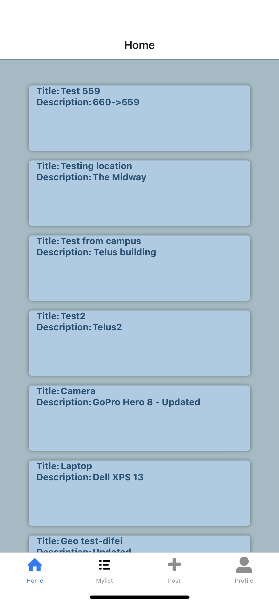
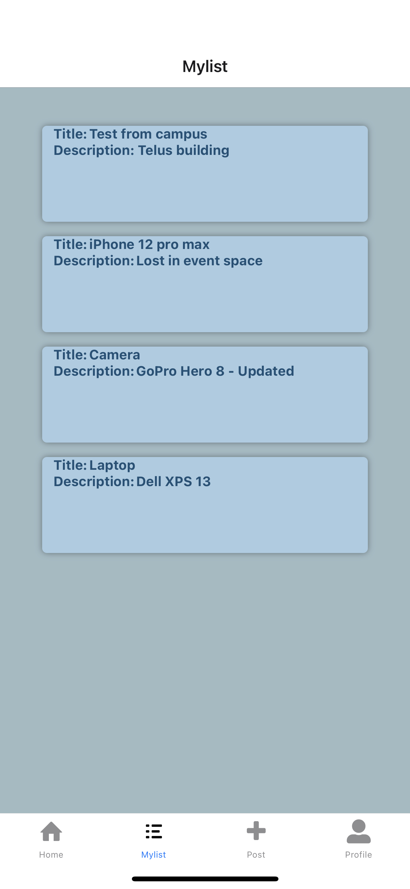
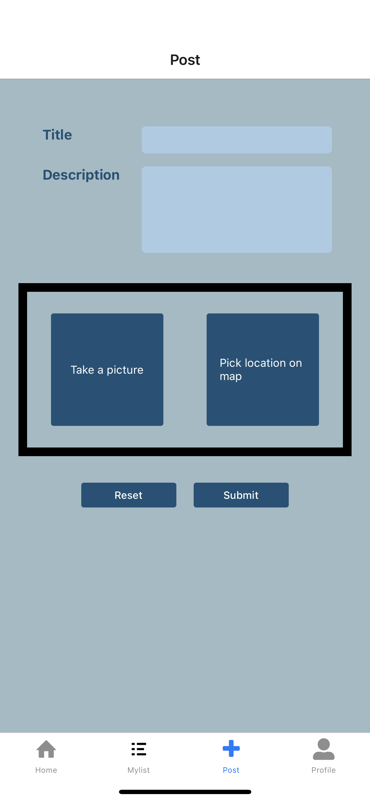
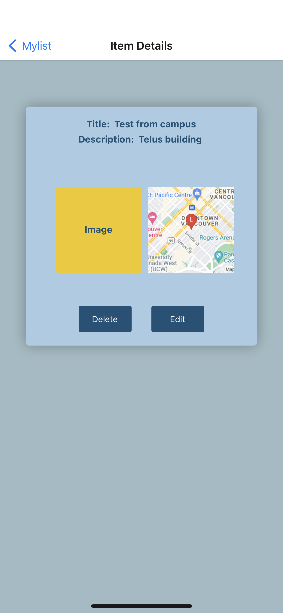

## Links

- [Iteration 2](#iteration-2) - [Contribution:](#contribution) - [Screenshots:](#screenshots)
- [Iteration 1](#iteration-1) - [Contribution:](#contribution-1) - [Screenshots:](#screenshots-1)

# Iteration 3

#### Contribution:

- Aly 
    * Fixed edit access
    * Made mapview following the marker on new location selected in map
    * Sorting Entry list by order
    * Overhauled all UI design
- Difei
    * Fixed edit acccess
    * Added AddressInput to autocomplete address input using geocoding
    * Added reverse geocoding in LocationManager
    * Added locations collection to store geoinfo
    * Removed buttons for users with no access
    * Updated user profile related info, adding user collections to include join dates and names and added them in detail page
- Zia
    * Fixed image issue when the map location was being changed
    * Added scheduled notification
    * Made map and image required field when adding a post
    * Made pictures shown on details page from the storage

# Iteration 2

#### Contribution:

- Difei - Implemented Authentication functionality. Created a Login page a Signup page, and added Firebase Authentication to allow the app to include users. Added proper authorization checks and filters that connect to a particular user in Add, Edit, MyList and Details screens.
- Zia - Implemented Camera functionality - Created ImageManager component that handles camera requests/verification, added preview for the image on the add screen. Created Firebase Storage, saved the images in the firebase storage.
- Aly - Implemented Location functionality - Created LocationManager component that handles location requests/verification, and links to a newly created Map screen where the user can select a location based on current one or default. Integrated saving location data to an entry document in Firestore, which can be fetched for preview/edit.

#### Known Issues / Bugs:

- Styling : styling was not prioritized in iterations 1 & 2 and can seem quite lacking, but it is a major focus of the upcoming Iteration 3.
- Camera Functionality : fetching images from storage and displaying them in Entry Details screen not implemented yet, to be completed in Iteration 3.
- Camera Functionality : Taking a picture is not working on Android due to an apparently abundant issue discussed online. This was consulted with the TA and is being sorted for the time being. Should be fixed by Iteration 3.

#### Screenshots:

1. Login
<pre>  </pre>

2. Signup
<pre>  </pre>

3. Home - home screen shows all posts/lost items from a user's community
<pre>  </pre>

4. MyList - shows only the user's own posts
<pre>  </pre>

5. Post
<pre>      </pre>

6. ItemDetails - clicking on a post in Home or MyList will route to this page, showing all details of said post/item.
<pre>  </pre>

# Iteration 1

#### Contribution:

- Difei - Implemented Navigation functionality
- Zia & Aly - Implemented CRUD operations